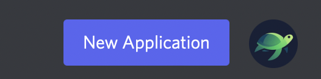
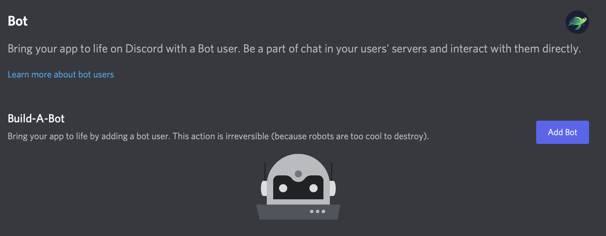
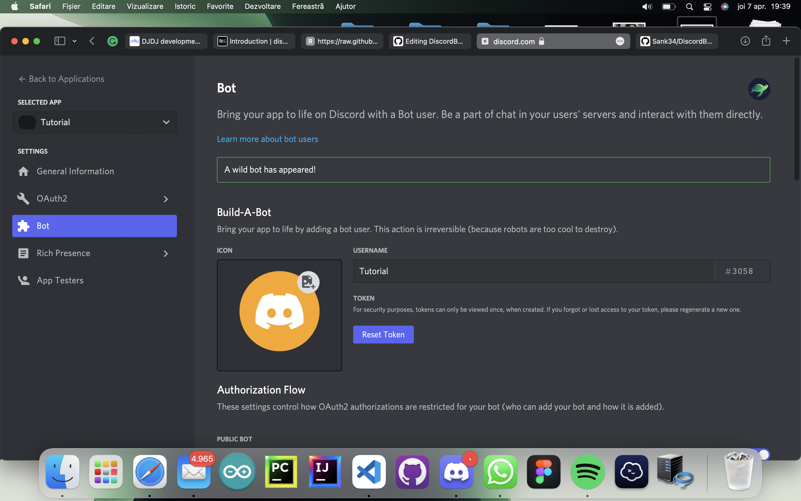

# DiscordBot-BaseCode
Hello! <br>
This is a base-code for a discord bot! <br>
If you don't know what a discord bot,you can see more [here](https://discordjs.guide/#before-you-begin)
## Requirments
- NPM -> v8.1.2
- NODE -> v16.13.1
- MODULES: <br>
      - discord.js -> v13.6.0 <br>
      - fs ->0.0.1-security
## Features
### Configurable
- It's fully configurable from the config.json
### Easy to understand
- You'll find explications commented everywhere where it was possible and necessary
### Built-in example commands
- We added some basic commands to understand how buttons, embed and simple messages work.
##### Need help?
Don't hesitate to contact us on our discord server! <br>
Just enter and open a ticket so you can let us know what is your problem and help you solve it 😄

## How to make a token/bot ?
- For creating a token,you'll need first to make an application. How? Don't worry, we got you!
### First steps
- Go to [Discord developer portal](https://discord.com/developers/applications),should look something like this:


- Create a new application, click on the "New Application" button



- Give it a brilliant name 😎(eventually put a photo as the app pfp)


- Now it's time to create the token, go to the bot section


- Click "Add bot" and agree



- Now it should look like this



- To make the code work, you'll need to check the intents from the dashboard


NOTE : To see the token, click "Reset token", you can see it one time after you reset the token.

- For inviting the bot, you'll need to make the invite link.
- Go to Quath2 -> URL generator 
- Now select the following scopes: **aplications.commands** (required for buttons and slash commands) ; **bot**
- You can also add permisions for the bot in the BOT section 
#### Awesome work! Now you have your own discord bot token! Let's get to the last step 👍

### Last Step -- config.json
- Now, for the code to work you'll need to complete the config file.
- Follow this config example in order to complete yours ;)

```json
{
  "hello": "Example for a variable in json", -> this is just an example for a variable in json, you can delete it
  "prefix": "Your prefix here", -> this is the bot prefix, see example.js to see how you can use it
  "token": "Your token here", -> this is the bot's secret client (token), we created it earlier 
  "status": "Your status here", -> this is the bot status that will be displayed on discord
  "ConsoleLogs":{
    "Startup": "Startup message",  -> the message that will appear in the console when the bot starts
    "ErrorActivateCMD": "Your error message" -> this is the message that will appear when a file can't be read
  },
  "credits":{
    "DjDev": "Made by DjDev", -> DJ's credits
    "TurtleDev": "Made by TurtleDev", -> turtleDev's credits
    "both": "Made by ScienceTurtles Team" -> team Credits 
  }

}
```
### This was the configuration for the code, if you still need help, consider joining our discord server and opening a ticket. Thanks!
[](https://discord.com/invite/26vT9wt3n3)
